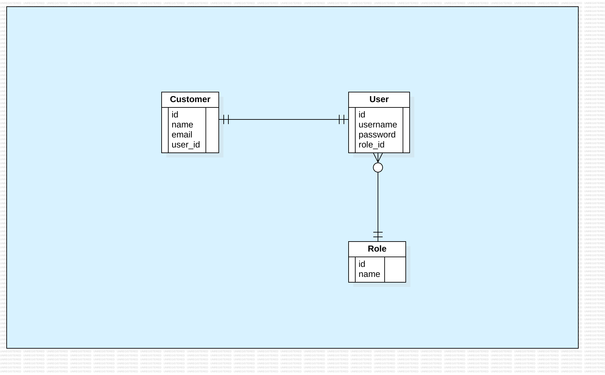

# PROJETO: microservice-2026

## Autoria

[Junior Martins](https://www.linkedin.com/in/juniorsmartins/)

## Índice

1.  [API - User](#api---user)
    * [Tecnologias](#tecnologias-user)
    * [Diagramas](#diagramas-user)
2.  [API - Account](#api---account)
    * [Entidades](#entidades-account)
    * [Endpoints](#endpoints-account)
3.  [API - Investment](#api---investment)
    * [Entidades](#entidades-investment)
    * [Endpoints](#endpoints-investment)
4.  [API - Notifications](#api---notifications)
    * [Entidades](#entidades-notifications)
    * [Endpoints](#endpoints-notifications)
5.  [API - Report](#api---report)
    * [Entidades](#entidades-report)
    * [Endpoints](#endpoints-report)

## API - User

### Tecnologias User

- Java 25;
- Spring Boot 3.5.6;
- Spring Data Web;
- Spring Data JPA;
- Spring Security;
- Bean Validation;
- Lombok;
- Liquibase (migration) - ;
- Apache Kafka (mensageria);
- PostgreSQL (banco de dados relacional);
- H2 Database (banco de dados em memória para testes);
- Docker (dockerfile e docker compose);

### Diagramas User

DER

## API - Account

## API - Investment

## API - Notifications

## API - Report

