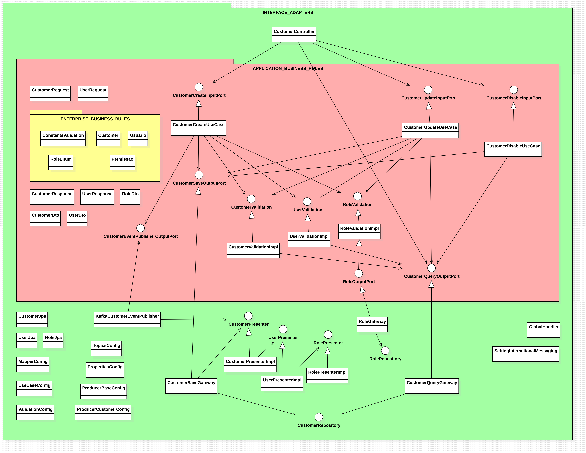
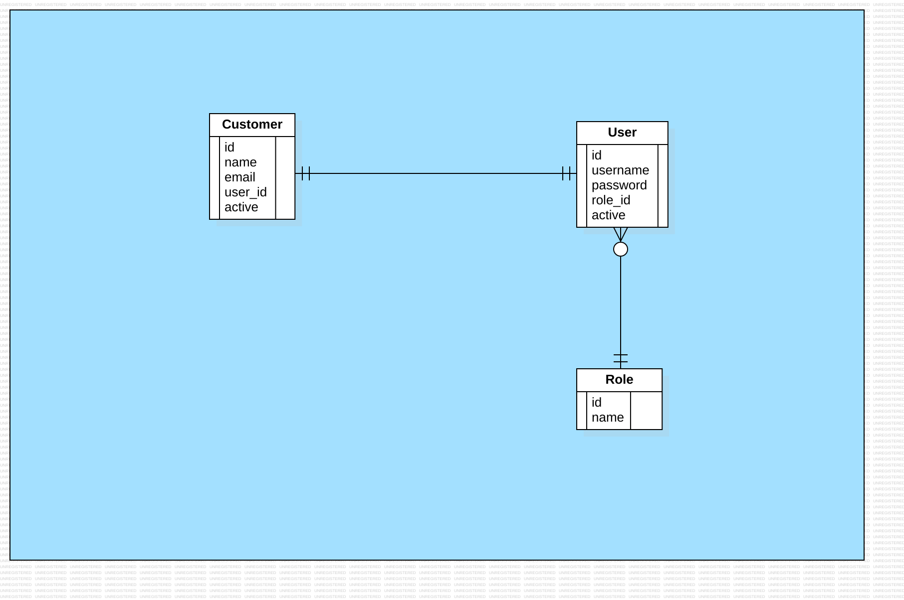

# PROJETO: currículo vivo

# EM CONSTRUÇÃO...

## Autoria

[Junior Martins](https://www.linkedin.com/in/juniorsmartins/)

## Índice

1.  [API - Users](#api---users)
    * [Tecnologias](#tecnologias-users);
    * [Diagramas](#diagramas-users);
2.  [API - Accounts](#api---accounts)
    * [Entidades](#entidades-account)
    * [Endpoints](#endpoints-account)
3.  [API - Investments](#api---investments)
    * [Entidades](#entidades-investment)
    * [Endpoints](#endpoints-investment)
4.  [API - Notifications](#api---notifications)
    * [Entidades](#entidades-notifications)
    * [Endpoints](#endpoints-notifications)
5.  [API - Reports](#api---reports)
    * [Entidades](#entidades-report)
    * [Endpoints](#endpoints-report)
6.  [Tutoriais](#tutoriais)
7.  [Como rodar a aplicação](#como-rodar-a-aplicacao) 
8.  [Coleções de teste para Postman](#colecoes-de-teste-para-postman)

## API - Users

### Tecnologias Users

- Java (versão 25);
- Gradle (versão 9.1.0);
- Spring Boot (versão 3.5.7);
- Spring Data Web;
- Spring Data JPA;
- Liquibase (migration em SQL);
- Apache Kafka, Schema Registry e Apache Avro (mensageria);
- RestAssured, JUnit e Mockito (testes);
- PostgreSQL (versão 17 - banco de dados relacional);
- H2 Database (banco de dados em memória para testes);
- Docker (dockerfile e docker compose);
- Lombok;
- DevTools.

### Diagramas Users

Arquitetura Limpa multi-modulo

DER

## API - Accounts

Arquitetura Hexagonal

## API - Investments

## API - Notifications

Arquitetura Multicamadas

## API - Reports

## Tutoriais

- [Gradle multi-modulo](docs/tutoriais/multimodulo.md);
- [Liquibase](docs/tutoriais/liquibase.md);
- [Kafka](docs/tutoriais/kafka.md);

