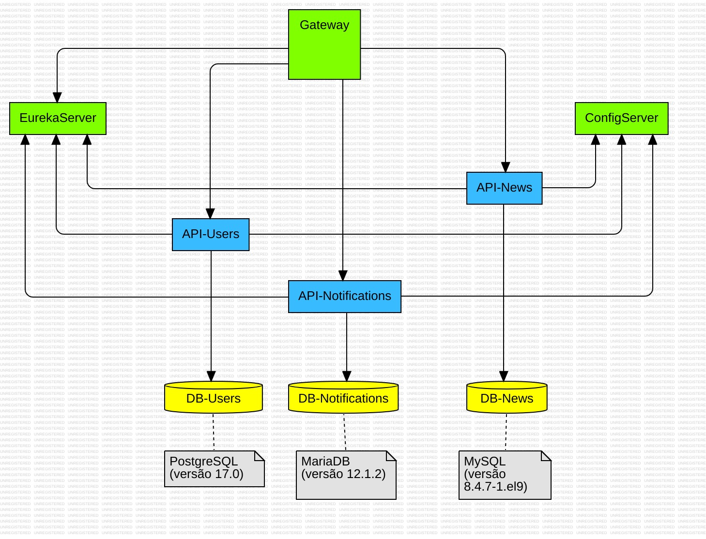
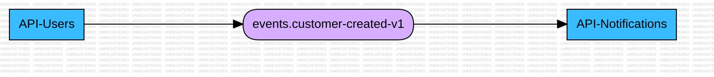

# PROJETO: currículo vivo

- Objetivo: microsserviços com ferramentas de pesquisa, estatística, investigação e publicação de material jornalístico. 
- Delimitação do problema: 
- Justificativa para a escolha do tema:

- Descrição geral do sistema:
- Regras de negócio:
- Endpoints:
- Requisitos do sistema (funcionais e não funcionais):
- Métricas

## Status de andamento (fase 1)

- Fase 1: construção da base do microsserviços: ConfigServer, EurekaServer, GatewayServer e primeiras APIs Rest (api-users e api-news);
- Fase 2: implementação de Security, IA, CI/CD e Observabilidade;
- Fase 3: construção das APIs de negócio, com toda a pirâmide de testes;
- Fase 4: construção do front-end com Angular;
- Fase 5: Kubernetes e Cloud;
- Fase 6: 

## Autoria

[Junior Martins](https://www.linkedin.com/in/juniorsmartins/)

## Índice

1. Arquitetura 
2.  [API-Users - clique aqui](docs/README-api-users.md)
3.  [API-Notifications - clique aqui](docs/README-api-notifications.md)
4.  [API-News - clique aqui](docs/README-api-news.md)
5.  [Config Server](#config-server)
6.  [Eureka Server](#eureka-server)
7.  [Gateway](#gateway)
8.  [Tutoriais](#tutoriais)
9.  [FAQ - Principais dúvidas](#faq---principais-dúvidas) 

## Arquitetura 

Arquitetura de Microsserviços


Arquitetura Orientada a Eventos



## Config Server

Microsserviço responsável por centralizar as configurações dos microsserviços.

### Tecnologias ConfigServer

- Java (versão 25);
- Gradle (versão 9.2.1);
- Spring Boot (versão 4.0.0);
- Spring Boot Actuator (monitoramento);
- Spring Cloud Config Server (versão 2025.1.0);
- Docker (dockerfile e docker compose);


## Eureka Server

Microsserviço responsável pelo registro e descoberta dos microsserviços.

### Tecnologias EurekaServer

- Java (versão 25);
- Gradle (versão 9.2.1);
- Spring Boot (versão 4.0.0);
- Spring Boot Actuator (monitoramento);
- Spring Cloud Netflix Eureka Server (versão 2025.1.0);
- Docker (dockerfile e docker compose);


## Gateway

Microsserviço responsável por rotear as requisições para os microsserviços.

### Tecnologias Gateway

- Java (versão 25);
- Gradle (versão 9.2.1);
- Spring Boot (versão 4.0.1);
- Spring Boot Actuator (monitoramento);
- Spring Cloud Netflix Eureka Client (versão 2025.1.0);
- Spring Doc OpenApi (versão 3.0.0);
- Docker (dockerfile e docker compose).


## Tutoriais

- [Gradle multi-modulo](docs/tutoriais/multimodulo.md);
- [Kafka](docs/tutoriais/kafka.md);
- [Liquibase](docs/tutoriais/liquibase.md);
- [Flyway](docs/tutoriais/flyway.md);
- [Spring Mail](docs/tutoriais/spring-mail.md); 
- [Config Server](docs/tutoriais/config-server.md);
- [Eureka Server](docs/tutoriais/eureka-server.md);
- [Gateway](docs/tutoriais/gateway.md);
- [Resiliência](docs/tutoriais/resiliencia.md);
- [Auditoria](docs/tutoriais/auditoria.md);
- [Padrões e Utilidades](docs/tutoriais/padroes-utils.md);
- [Spring Data AOT](docs/tutoriais/NOT-spring-data-aot.md)
- [API Versioning](docs/tutoriais/api-versioning.md);


## FAQ - Principais dúvidas

1. Quais dependências preciso ter no meu computador para rodar esta aplicação?
```
1. Docker;
2, Docker Compose.
```

2. Como rodar a aplicação?
```
1. Abra o terminal do seu notebook com o comando: Ctrl + Alt + t;
2. No terminal, rode o comando: git clone git@github.com:juniorsmartins/microservice-2026.git 
3. Abra sua IDE e abre o projeto clonado;
4. Abra o terminal da IDE;
5. Rode o comando: cd docker
6. Rode o comando: docker compose up --build 
7. Pronto! Sua aplicação subirá em alguns segundos.
```

3. Como acessar a documentação viva por Spring Doc?
```
1. Depois de rodar a aplicação (pergunta 1 do FAQ), verifique se os serviços estão 
ativos no EurekaServer: http://localhost:8761/ 

2. Com os serviços ativos, acesse a url da documentação via GatewayServer: http://localhost:8765/swagger-ui/index.html

3. Você pode alternar a documentação de todas as APIs em "Select a definition" (canto superior direito da tela).
```

4. Como testar o microsserviços manualmente? 

Estratégia 1
```
1. Depois de rodar a aplicação (pergunta 1 do FAQ), acesse a documentação via GatewayServer: http://localhost:8765/swagger-ui/index.html
2. Você pode testar pela própria documentação.
```

Estratégia 2 (link da coleção do postman - ainda não disponibilizei !!!??? )
```
1. Pode baixar um arquivo de coleções do Postman. Possui requisições prontas para testar;
2. Importar esse arquivo de coleções no seu Postman;
3. Testar.
```


