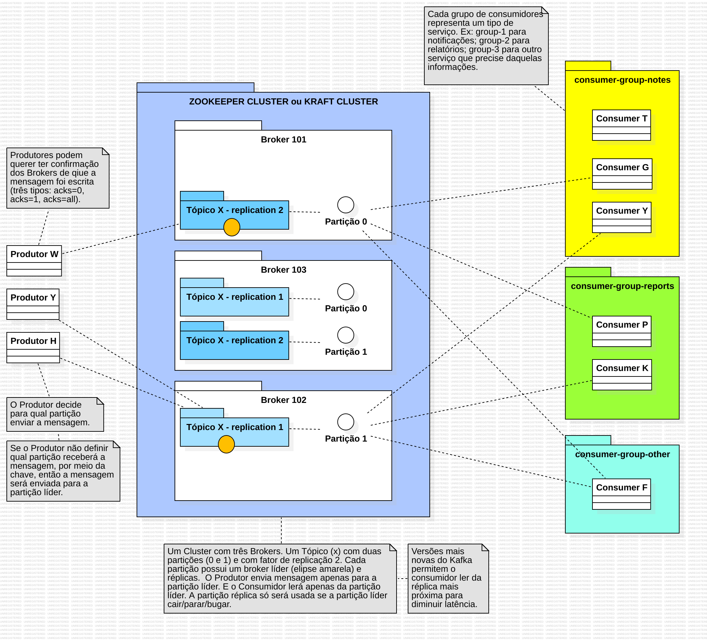

# TUTORIAL

#### Fontes: 
- https://kafka.apache.org/intro 
- https://kafka.apache.org/documentation/ 
- https://kafka.apache.org/documentation/#design 
- https://kafka.apache.org/documentation.html#adminapi 
- https://docs.confluent.io/kafka/introduction.html 
- https://avro.apache.org/docs/1.12.0/getting-started-java/ 
- https://aws.amazon.com/pt/what-is/apache-kafka/ (Kafka x RabbitMQ) 
- https://www.redhat.com/pt-br/topics/integration/what-is-apache-kafka 
- https://www.baeldung.com/apache-kafka 
- https://www.datacamp.com/pt/tutorial/apache-kafka-for-beginners-a-comprehensive-guide 
- https://medium.com/@fabiosalomao/uma-breve-introdu%C3%A7%C3%A3o-ao-kafka-8bb32b2059ac 
- https://kafka-options-explorer.conduktor.io/ 
- https://docs.conduktor.io/learn/fundamentals/producers 
- https://docs.conduktor.io/learn/fundamentals/consumers 
- https://docs.conduktor.io/learn/fundamentals/topic-replication 
- https://hub.docker.com/r/lensesio/fast-data-dev 


## Teoria

### Introdução
```
Apache Kafka é uma plataforma open source distribuída para transmissão de dados capaz de 
publicar, subscrever, armazenar e processar fluxos de registro em tempo real. 

Kafka é um sistema distribuído composto por servidores e clientes que comunicam através de 
um protocolo de rede TCP de alto desempenho. Em sua essência, o Kafka é um sistema de 
mensagens de inscrição publicado distribuído. Os dados são gravados em tópicos do Kafka 
pelos produtores e consumidos pelos consumidores. Os tópicos do Kafka podem ser 
particionados, habilitando o processamento paralelo de dados, e os tópicos podem ser 
replicados em vários corretores para tolerância a falhas.
```
### Conceitos Centrais
```
EVENTO - Um evento registra o fato de que "algo aconteceu" no mundo ou no seu negócio. 
Também é chamado de registro ou mensagem na documentação. Quando você lê ou grava dados 
para o Kafka, você faz isso na forma de eventos. Conceitualmente, um evento tem uma chave, 
valor, carimbo de data/hora e cabeçalhos de metadados opcionais.

TÓPICO - Os tópicos do Kafka organizam eventos relacionados. Por exemplo, podemos ter um 
tópico chamado logs, que contém logs de um aplicativo. Os tópicos são aproximadamente 
análogos às tabelas SQL. No entanto, ao contrário das tabelas SQL, os tópicos do Kafka não 
são consultáveis. Em vez disso, devemos criar produtores e consumidores da Kafka para 
utilizar os dados. Os dados nos tópicos são armazenados na forma chave-valor em formato 
binário.

PRODUTOR - Uma vez que um tópico é criado no Kafka, o próximo passo é enviar dados para o 
tópico. Os aplicativos que enviam dados para um tópico são conhecidos como produtores de 
Kafka. Os produtores publicam eventos (gravam) para o Kafka. Observe que os produtores de 
Kafka são implantados fora do Kafka e só interagem com o Apache Kafka enviando dados 
diretamente para os tópicos do Kafka.

CONSUMIDOR - Uma vez que um tópico foi criado e os dados produzidos no tópico, podemos ter 
aplicativos que fazem uso do fluxo de dados. Aplicativos que extraem dados de eventos de um 
ou mais tópicos do Kafka são conhecidos como consumidores do Kafka. Os consumidores são 
aqueles que se inscrevem (leêm e processam) esses eventos. Observe que os consumidores do 
Kafka são implantados fora do Kafka e só interagem com o Apache Kafka lendo dados 
diretamente dos tópicos do Kafka.

Os eventos são organizados e armazenados de forma durável em tópicos. Muito simplificado, 
um tópico é semelhante a uma pasta em um sistema de arquivos, e os eventos são os arquivos 
nessa pasta. Um exemplo de nome de tópico pode ser "pagamentos". Os tópicos no Kafka são 
sempre multi-produtor e multi-assinante: um tópico pode ter zero, um ou muitos produtores 
que escrevem eventos para ele, bem como zero, um ou muitos consumidores que assinam esses 
eventos. Eventos em um tópico podem ser lidos com a frequência necessária – ao contrário 
dos sistemas de mensagens tradicionais, os eventos não são excluídos após o consumo. Em 
vez disso, você define por quanto tempo o Kafka deve reter seus eventos por meio de uma 
configuração por tópico, após o qual os eventos antigos serão descartados. 

Os tópicos são particionados, o que significa que um tópico é distribuído por uma série 
de "baldes" localizados em diferentes corretores Kafka. Esse posicionamento distribuído 
de seus dados é muito importante para a escalabilidade, pois permite que os aplicativos 
do cliente leiam e escrevam os dados de/para muitos corretores ao mesmo tempo. Quando um 
novo evento é publicado em um tópico, ele é realmente anexado a uma das partições do 
tópico. Eventos com a mesma chave de evento (por exemplo, um cliente ou ID do veículo) 
são gravados na mesma partição, e a Kafka garante que qualquer consumidor de um determinado 
tópico-partição sempre lerá os eventos dessa partição exatamente na mesma ordem em que 
foram escritos. 

ECOSSISTEMA KAFKA - Uma série de ferramentas e bibliotecas adicionais foram desenvolvidas 
para o Kafka ao longo dos anos para expandir sua funcionalidade: Kafka Streams, Kafka 
Connect, Schema Registry, Data schemas e KsqlDB. 

- Zookeeper: foi usado para coordenar e gerenciar o cluster Kafka, mantendo informações 
sobre os brokers, tópicos e partições. No entanto, com o desenvolvimento do KRaft (Kafka 
Raft), o Zookeeper está sendo gradualmente substituído, permitindo que o Kafka se torne 
uma plataforma ainda mais autônoma e eficiente. 

- Kafka Raft (KRaft): novo modo sem Zookeeper. Mais simples e rápido.

- Sobre os logs do Kafka na inicialização da aplicação: primeiro é criado um AdminClient 
(usa só no startup). O Spring Kafka cria automaticamente para verificar se os tópicos 
existem ou para criá-los automáticamente (se allow.auto.create.topics = true) e pegar 
metadados do cluster. Depois que termina o startup, ele é fechado normalmente (por isso 
aparece "unregistered" e "metrics scheduler closed" logo depois). Isso é totalmente 
normal.
```
### Conceitos Avançados
```
TÓPICO - Os tópicos do Kafka podem conter qualquer tipo de mensagem em qualquer formato e 
a sequência de todas essas mensagens é chamada de fluxo de dados. Por padrão, os dados em 
tópicos do Kafka são excluídos após uma semana (também chamado de período de retenção de 
mensagens padrão) e esse valor é configurável. Este mecanismo de exclusão de dados antigos 
garante que um cluster Kafka não fique sem espaço em disco por tópicos de reciclagem ao 
longo do tempo. 

    * Convenções de nomeação de tópico: os nomes podem conter letras minúsculas (a-z), 
    letras maiúsculas (A-Z), números (0-9), períodos (.), underscores (_) e hífens (-). O 
    comprimento máximo é de 255 caracteres mas mantenha com menos de 100 para 
    legibilidade. Boa prática é usar os padrões kebab-case ou snake_case ou 
    notação.de.ponto para nomear. Veja estratégias de nomeação organizacional: 
    
        1. Nomeação baseada em domínio: organizar tópicos por domínio empresarial. Ex: 
        users.registration, orders.created, orders.updated, payment.failed e etc. 
        
        2. Nomeação baseada em serviço: organize tópicos possuindo serviços. Ex: 
        user-service.events, user-service.replies, order-service.events e etc. 
        
        3. Nomeação baseada em tipo de dados: organize tópicos por características de 
        dados. Ex: events.user-registered e events.order-placed (events - imutable facts); 
        comands.process-payment, comands.update-inventory e comands.send-notification 
        (comands - requests for actions); snapshots.user-profiles, 
        snapshots.product-catalog e snapshot.inventory-levels (snapshots - current state).
        
        4. Nomeação específica do ambiente: pode usar prefixos de ambiente ou sufixos de 
        ambiente ou separação por cluster. Ex: dev.user-events, prod.user-events, 
        user-events.dev, user-events.prod e etc. 
        
        * Estratégia de versionamento: sufixo de versão (user-events-v1, user-events-v1 
        ou order-schema-v1_0, order-schema-v1_1), evolução do esquema (esse padrão é 
        preferencial - o versionamento é separado). 
        
        * Outras convenções aqui: https://docs.conduktor.io/learn/advanced/topics/naming-conventions 

PARTIÇÃO - Os tópicos são divididos em várias partições. Um único tópico pode ter mais de 
uma partição, é comum ver tópicos com 100 partições. O número de partições de um tópico é 
especificado no momento da criação do tópico. Os tópicos do Kafka são imutáveis: uma vez 
que os dados são gravados em uma partição, eles não podem ser alterados. Cada tópico é 
dividido em partições para permitir paralelismo e escalabilidade. É como dividir uma 
estrada em várias faixas para aumentar o tráfego. A ordem das mensagens é garantida por 
partição, não globalmente.

OFFSETs - O offset é um ID sequencial de cada mensagem na partição. As mensagens recebem 
um número de ordem (offset) dentro de uma partição. Isso garante que as mensagens sejam 
entregues ao consumidor na mesma ordem em que foram armazenadas na partição. A numeração 
começa em 0 e é incrementado em um para cada mensagem enviada para uma partição 
específica. Isso significa que os offsets têm significado apenas para a partição 
específica, por exemplo, o offset 3 na partição 0 não representa os mesmos dados que o 
offset 3 na partição 1. Kafka offset ordering: se um tópico tem mais de uma partição, 
Kafka garante a ordem de mensagens dentro de uma partição, mas não há ordenação de 
mensagens entre partições.

PRODUTOR - Um produtor envia mensagens para um tópico e as mensagens são distribuídas 
para partições de acordo com um mecanismo como hashing de chave. Para que uma mensagem 
seja escrita com sucesso em um tópico, um produtor deve especificar um nível de 
reconhecimento (acks).

MESSAGE KEYS - Cada mensagem de evento contém uma chave opcional e um valor. No caso da 
chave (key = null) não é especificado pelo produtor, as mensagens são distribuídas 
uniformemente entre partições em um tópico. Isso significa que as mensagens são enviadas 
de forma round-robin. Se uma chave for enviada (key != null), então todas as mensagens que 
compartilham a mesma chave serão sempre enviadas e armazenadas na mesma partição Kafka. 
Uma chave pode ser qualquer coisa para identificar uma mensagem - uma string, valor 
numérico, valor binário, etc.

ANATOMIA DA MENSAGEM KAFKA - As mensagens Kafka são criadas pelo produtor. Estrutura:

    * Chave: A chave é opcional na mensagem Kafka e pode ser nula. Uma chave pode ser uma 
    cadeia de caracteres, número ou qualquer objeto e, em seguida, a chave é serializada 
    em formato binário.
    
    * Valor: O valor representa o conteúdo da mensagem e também pode ser nulo. O formato 
    de valor é arbitrário e também é serializado em formato binário.

    * Tipo de Compressão: Mensagens Kafka podem ser comprimidas. O tipo de compressão 
    pode ser especificado como parte da mensagem. As opções são none, gzip, lz4, 
    snappy, e zstd.

    * Cabeçalhos (Headers): Pode haver uma lista de cabeçalhos de mensagens Kafka 
    opcionais na forma de pares de valor de chave. É comum adicionar cabeçalhos para 
    especificar metadados sobre a mensagem, especialmente para rastreamento.
    
    * Partição + Offset: Uma vez que uma mensagem é enviada para um tópico do Kafka, ela 
    recebe um número de partição e um id de deslocamento. A combinação de topic + 
    partition + offset identifica exclusivamente a mensagem.
    
    * Carimbo de data e hora (Timestamp): Um carimbo de data/hora é adicionado pelo 
    usuário ou pelo sistema na mensagem.
    
CONSUMIDOR - Aplicativos que leem dados de tópicos são conhecidos como consumidores. Um 
consumidor sempre lê dados de um offset mais baixo para um offset mais alto e não pode ler 
dados de trás para frente. Os consumidores também são conhecidos por implementar um 
“modelo de puxar”. Isso significa que os consumidores devem solicitar dados de brokers 
para obtê-los (em vez de ter brokers continuamente empurrando dados para os 
consumidores). Esta implementação foi feita para que os consumidores possam controlar a 
velocidade com que os tópicos estão sendo consumidos.

GRUPO DE CONSUMIDORES - Vimos que os consumidores podem consumir dados de partições de 
tópicos individualmente, mas para fins de escalabilidade horizontal recomenda-se consumir 
tópicos como um grupo. Os consumidores que fazem parte da mesma aplicação e, portanto, 
executam o mesmo “trabalho lógico” podem ser agrupados como um grupo de consumidores. Um 
tópico geralmente consiste em muitas partições. Essas partições são uma unidade de 
paralelismo para os consumidores. O benefício de alavancar um grupo de consumidores é que 
os consumidores dentro do grupo se coordenarão para dividir o trabalho de leitura de 
diferentes partições.

    * ID de grupo (group-id): Para indicar aos consumidores que fazem parte do mesmo 
    grupo específico, temos de especificar a definição do lado do consumidor group.id. O 
    Kafka garante que cada partição seja lida por exatamente um consumidor do grupo. Se 
    você tem 10 partições e 3 consumidores com o mesmo group-id, o Kafka divide as 10 
    partições entre os 3. Se um consumidor morre ou sobe outro, acontece um rebalance → o 
    Kafka redistribui as partições. Veja quais são as estratégias de rebalanceamento: 
    RangeAssignor, RoundRobinAssignor, StickyAssignor e CooperativeStickyAssignor.  
    
        1.1 - Eager Rebalance: procura balancear deixando cada partição ligada a um 
        consumidor. Caso existam mais partições do que consumidores, então algum 
        consumidor receberá mensagens de mais de uma partição. Quando está funcionando e 
        entra ou sai um consumidor no grupo, o Eager Rebalance faz todos os consumidores 
        pararem de funcionar para redistribuir as partições aos consumidores. Há uma 
        parada geral antes da redistribuição e isso não é bom. Além disso, a 
        redistribuição é aleatória, o que não garante que um consumidor pegará a mesma 
        partição que já estava lendo.
        
            1.1.1 - RangeAssignor: ordena partições e consumidores → cada consumidor pega 
            um bloco contíguo. Ex: 10 partições e 3 consumers → 0-3, 4-6, 7-9.
            
            1.1.2 - RoundRobinAssignor: distribui uma partição por vez, em ciclo. Ex: 
            partição 0 → consumer A, 1 → B, 2 → C ... Envia uma mensagem para a partição 
            0, depois envia uma mensagem para a partição 1, depois para a 2 e assim 
            sucessivamente até retornar para a 0 e seguir. Possui throughput menor, 
            latência maior e consome mais rede e CPU do broker. Ainda usado em sistemas 
            legados (vinha ativado por padrão). Uso não recomendado!
    
            1.1.3 - StickyAssignor: faz o melhor balanceamento possível e tenta manter as 
            partições nos mesmos consumidores no próximo rebalance. Menos movimento que 
            RoundRobin, mas ainda para todos os consumidores para a reatribuição de 
            partições.
    
        1.2 - Cooperative Rebalance (ou Incremental Rebalance): ao invés de parar todos 
        os consumidores para reatribuir todas as partições para eles, essa estratégia 
        reatribui apenas as partições que não possuem um consumidor exclusivo. Por 
        exemplo, um consumidor com duas partições terá uma delas removida e reatribuída 
        e tudo isso sem precisar parar o consumidor. Bem como sem parar consumidores que 
        só possuem uma partição. Isso evita a parada geral e permite que alguns 
        consumidores não afetados continuem processando. 
                
            1.2.1 - CooperativeStickyAssignor: somente quem precisa (quem saiu ou entrou) 
            perde/ganha partições → Mantém o máximo de atribuições antigas (sticky). Envia 
            mensagens à mesma partição até o batch ficar cheio ou o linger.ms estourar, 
            depois troca de partição. Possui throughut até 50% maior, menor latência 
            (menos trocas de conexão e menos batches pequenos) e consumo menor de rede e 
            CPU.
            
            Observação: o padrão default do Kafka 3.0 é a lista [RangeAssignor, 
            CooperativeStickyAssignor]. Ele usará o RangeAssignor, mas se você removê-lo, 
            ele passará a usar o CooperativeStickyAssignor (partition.assignment.strategy). 
            
            Explicar: Static Group Membership (group.instance.id). Isso fornece 
            identificação estática para o consumidor e evita rebalanceamentos. Todos os 
            consumidores do grupo ficam tendo o mesmo ID estático. Então quando o 
            consumidor sai, a partição dele não é reatribuída de imediato e espera por um 
            tempo configurável (session.timeout.ms). Daí, quando um consumidor entrar, 
            essa partição é reatribuída sem ter gerado a ação de rebalance geral. Isso 
            evita o rebalanceamento. 
    
    * Balanceamento: Os consumidores usam automaticamente a GroupCoordinator e a 
    ConsumerCoordinator para atribuir os consumidores a uma partição e garantir que o 
    balanceamento de carga seja alcançado em todos os consumidores do mesmo grupo. É 
    importante notar que cada partição de tópico é atribuída apenas a um consumidor 
    dentro de um grupo de consumidores, mas um consumidor de um grupo de consumidores 
    pode receber várias partições.
    
    * Consumer Offset: Os brokers usam um tópico interno nomeado __consumer_offsets que 
    mantém o controle de quais mensagens um determinado grupo de consumidores foi 
    processado por último com sucesso. Por qual motivo usar Consumer Offset? Se um 
    cliente Kafka falhar, um reequilíbrio ocorre e o mais recente offset commitado ajuda 
    os consumidores restantes a saber onde reiniciar a leitura e o processamento de 
    mensagens.
    
    * Semântica de entrega/commit: Por padrão, os consumidores Java comitam automaticamente 
    offsets (controlados pela propriedade enable.auto.commit = true) a cada 
    (auto.commit.interval.ms) 5 segundos por padrão quando .poll() é chamado. Um consumidor 
    pode optar por cometer compensações por si mesmo (enable.auto.commit = false). Há três 
    estratégias de semânticas de entrega: No máximo uma vez (At most once), Pelo menos uma 
    vez (At least once) e Exatamente uma vez (Exactly once).
        
        - No máximo uma vez (At most once): Os offsets são comitados assim que a mensagem 
        é recebida. Se o processamento der errado, a mensagem será perdida (não será lida 
        novamente).
        
        - Pelo menos uma vez (At least once): Os offsets são comitados após a mensagem 
        ser processada. Se o processamento der errado, a mensagem será lida novamente. 
        Isso pode resultar em processamento duplicado de mensagens. Portanto, é melhor 
        prática garantir que o processamento de dados seja idempotente (ou seja, 
        processar a mesma mensagem duas vezes não produzirá nenhum efeito indesejável).
        
        - Exatamente uma vez (Exactly once): Isso só pode ser alcançado para o tópico 
        para fluxos de trabalho usando a API de transações. A API do Kafka Streams 
        simplifica o uso dessa API e permite exatamente uma vez que usa a configuração 
        processing.guarantee = exactly_once_v2.

BROKER - um nó/servidor Kafka em execução. Recebe, armazena e entrega mensagens. Os 
brokers armazenam dados em um diretório no disco do servidor em que são executados. Cada 
partição de tópico recebe seu próprio subdiretório com o nome associado do tópico. Para 
obter alto rendimento e escalabilidade em tópicos, os tópicos são divididos. Se houver 
vários brokers em um cluster, então partições para um determinado tópico serão 
distribuídas entre os brokers uniformemente, para obter balanceamento de carga e 
escalabilidade.

CLUSTER - conjunto de brokers trabalhando juntos (cluster = vários brokers). Fornece 
escalabilidade, alta disponibilidade e tolerância a falhas. Os brokers se comunicam para 
coordenar líderes de partições, replication, etc. 

BOOTSTRAP SERVERS (bootstrap-servers): Um cliente que deseja enviar ou receber mensagens 
do cluster do Kafka pode se conectar a qualquer broker do cluster. Todo broker no cluster 
tem metadados sobre todos os outros e ajudará o cliente a se conectar a eles também, e, 
portanto, qualquer broker no cluster também é chamado de servidor bootstrap. O servidor 
bootstrap retornará metadados para o cliente que consiste em uma lista de todos os 
brokers do cluster. Então, quando necessário, o cliente saberá a qual broker exatamente 
se conectar para enviar ou receber dados e descobrir com precisão quais broker contêm a 
partição de tópico relevante. Exemplo da lista de brokers: kafka1:9092,kafka2:9092... 

FATOR DE REPLICAÇÃO DE TÓPICO: Uma das principais razões para a popularidade da Kafka, é a 
resiliência que ela oferece diante de falhas de broker. As máquinas falham, e muitas vezes 
não podemos prever quando isso vai acontecer ou impedir isso. O Kafka foi projetado com a 
replicação como um recurso central para suportar essas falhas, mantendo o tempo de 
atividade e a precisão dos dados. O fator de replicação é uma configuração de tópico e é 
especificado no tempo de criação do tópico. Um fator de replicação de 1 significa nenhuma 
replicação. É usado principalmente para fins de desenvolvimento e deve ser evitado em 
clusters de teste e de produção. Um fator de replicação de 3 é um fator de replicação 
comumente usado, pois fornece o equilíbrio certo entre a perda de broker e a sobrecarga de 
replicação.

PARTIÇÃO LÍDER E RÉPLICAS: Para uma determinada partição de tópico, um broker é designado 
pelo cluster para ser responsável pelo envio e recebimento de dados para os clientes. Esse 
broker é conhecido como o líder dessa partição de tópico. Qualquer outro broker que esteja 
armazenando dados replicados para essa partição é referido como uma réplica. Portanto, 
cada partição tem um líder e várias réplicas. Se o líder falhar, uma das réplicas será 
eleita como o novo líder de partição por uma eleição.

    * RÉPLICAS IN-SYNC (ISR) - Uma ISR é uma réplica que está atualizada com o broker líder 
    para uma partição. Qualquer réplica que não esteja atualizada com o líder está fora de 
    sincronia. 

ACKS: Os produtores só escrevem dados para o atual líder de uma partição. Os produtores 
devem também especificar um nível de reconhecimento acks para definir se a mensagem deve 
ser escrita para um número mínimo de réplicas antes de ser considerada uma gravação 
bem-sucedida. O padrão é acks all a partir da versão 3 do Kafka. 

    * ACKS = 0 - Quando acks=0 produtores consideram as mensagens como “escritas com 
    sucesso” no momento em que a mensagem foi enviada sem esperar que o broker a 
    aceitasse.

    * ACKS = 1 - Quando acks=1, os produtores consideram as mensagens como “escritas com 
    sucesso” quando a mensagem foi reconhecida apenas pelo líder. 

    * ACKS = -1 ou all - Quando acks=all, os produtores consideram as mensagens como 
    “escritas com sucesso” quando a mensagem é aceita por todas as réplicas in-sync (ISR).
    
        - O min.insync.replicas pode ser configurado tanto no tópico quanto no nível do 
        broker. Os dados são considerados comprometidos quando são gravados em todas as 
        réplicas em sincronia - min.insync.replicas. Um valor de 2 implica que pelo menos 
        2 brokers que são ISR (incluindo líder) devem responder que eles têm os dados.

```
### Configuração
```


- auto-offset-reset (earliest, latest e none): define onde começa a ler as mensagens. 
earliest começa do início da partição; latest somente novas mensagens (padrão); none lança 
exceção se não houver offset; 

- key-serializer: como serializar a chave da mensagem;

- value-serializer: como serializar o valor da mensagem;

- Schema Registry: controle de versão de mensagens (Avro, JSON Schema); Garante 
compatibilidade entre producer/consumer.

- Dead Letter Topic (DLT): mensagens com falha de processamento são redirecionadas para 
um tópico de erro.

- producer.properties.enable.idempotence (true ou false): garante que mensagens não 
sejam duplicadas mesmo com retries. Requer: acks=all, 
max.in.flight.requests.per.connection ≤ 5, retries > 0;

- max.in.flight.requests.per.connection: controla quantas requisições não confirmadas o 
produtor pode enviar ao mesmo tempo. 5 é seguro com idempotência. >5 pode bagunçar ordem.

- consumer.properties.spring.json.trusted.packages ("*"): define os pacotes com permissão 
onde se pode desserializar. Evita ataques de desserialização. O uso do "*" permite 
desserializar em qualquer pacote.

- auto.register.schemas (true ou false): true → Schema Registry registra schema 
automaticamente. false -> só pode usar schemas já registrados → mais seguro.

- specific.avro.reader (true ou false): true -> o consumidor recebe classes Avro geradas.
false -> recebe GenericRecord;

- Acks: configura como o produtor confirma envio: acks=0 não espera confirmação; acks=1 
confirma no líder (rápido); acks=all confirma em todos os replicas (seguro);

```

Diagrama de resumo do Kafka


Anatomia da Mensagem Kafka
 

PASSO-A-PASSO 

1. Adição de dependências no build.gradle;
2. Configurações no application.yml;
3. 


