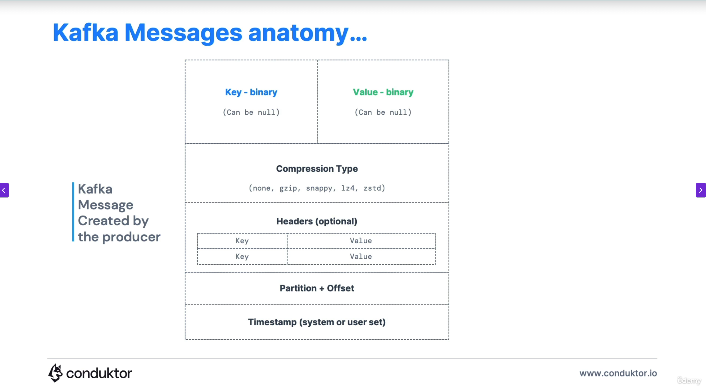

# TUTORIAL

#### Fontes: 
- https://kafka.apache.org/intro 
- https://kafka.apache.org/documentation/ 
- https://kafka.apache.org/documentation/#design 
- https://kafka.apache.org/documentation.html#adminapi 
- https://docs.confluent.io/kafka/introduction.html 
- https://avro.apache.org/docs/1.12.0/getting-started-java/ 
- https://aws.amazon.com/pt/what-is/apache-kafka/ (Kafka x RabbitMQ) 
- https://www.redhat.com/pt-br/topics/integration/what-is-apache-kafka 
- https://www.baeldung.com/apache-kafka 
- https://www.datacamp.com/pt/tutorial/apache-kafka-for-beginners-a-comprehensive-guide 
- https://medium.com/@fabiosalomao/uma-breve-introdu%C3%A7%C3%A3o-ao-kafka-8bb32b2059ac 
- https://kafka-options-explorer.conduktor.io/ 
- https://docs.conduktor.io/learn/fundamentals/producers 
- https://docs.conduktor.io/learn/fundamentals/consumers 
- https://docs.conduktor.io/learn/fundamentals/topic-replication 
- https://hub.docker.com/r/lensesio/fast-data-dev 


## Teoria

### Introdução
```
Apache Kafka é uma plataforma open source distribuída para transmissão de dados capaz de 
publicar, subscrever, armazenar e processar fluxos de registro em tempo real. 

Kafka é um sistema distribuído composto por servidores e clientes que comunicam através de 
um protocolo de rede TCP de alto desempenho. Em sua essência, o Kafka é um sistema de 
mensagens de inscrição publicado distribuído. Os dados são gravados em tópicos do Kafka 
pelos produtores e consumidos pelos consumidores. Os tópicos do Kafka podem ser 
particionados, habilitando o processamento paralelo de dados, e os tópicos podem ser 
replicados em vários corretores para tolerância a falhas.
```
### Conceitos Centrais
```
EVENTO - Um evento registra o fato de que "algo aconteceu" no mundo ou no seu negócio. 
Também é chamado de registro ou mensagem na documentação. Quando você lê ou grava dados 
para o Kafka, você faz isso na forma de eventos. Conceitualmente, um evento tem uma chave, 
valor, carimbo de data/hora e cabeçalhos de metadados opcionais.

TÓPICO - Os tópicos do Kafka organizam eventos relacionados. Por exemplo, podemos ter um 
tópico chamado logs, que contém logs de um aplicativo. Os tópicos são aproximadamente 
análogos às tabelas SQL. No entanto, ao contrário das tabelas SQL, os tópicos do Kafka não 
são consultáveis. Em vez disso, devemos criar produtores e consumidores da Kafka para 
utilizar os dados. Os dados nos tópicos são armazenados na forma chave-valor em formato 
binário.

PRODUTOR - Uma vez que um tópico é criado no Kafka, o próximo passo é enviar dados para o 
tópico. Os aplicativos que enviam dados para um tópico são conhecidos como produtores de 
Kafka. Os produtores publicam eventos (gravam) para o Kafka. Observe que os produtores de 
Kafka são implantados fora do Kafka e só interagem com o Apache Kafka enviando dados 
diretamente para os tópicos do Kafka.

CONSUMIDOR - Uma vez que um tópico foi criado e os dados produzidos no tópico, podemos ter 
aplicativos que fazem uso do fluxo de dados. Aplicativos que extraem dados de eventos de um 
ou mais tópicos do Kafka são conhecidos como consumidores do Kafka. Os consumidores são 
aqueles que se inscrevem (leêm e processam) esses eventos. Observe que os consumidores do 
Kafka são implantados fora do Kafka e só interagem com o Apache Kafka lendo dados 
diretamente dos tópicos do Kafka.

Os eventos são organizados e armazenados de forma durável em tópicos. Muito simplificado, 
um tópico é semelhante a uma pasta em um sistema de arquivos, e os eventos são os arquivos 
nessa pasta. Um exemplo de nome de tópico pode ser "pagamentos". Os tópicos no Kafka são 
sempre multi-produtor e multi-assinante: um tópico pode ter zero, um ou muitos produtores 
que escrevem eventos para ele, bem como zero, um ou muitos consumidores que assinam esses 
eventos. Eventos em um tópico podem ser lidos com a frequência necessária – ao contrário 
dos sistemas de mensagens tradicionais, os eventos não são excluídos após o consumo. Em 
vez disso, você define por quanto tempo o Kafka deve reter seus eventos por meio de uma 
configuração por tópico, após o qual os eventos antigos serão descartados. 

Os tópicos são particionados, o que significa que um tópico é distribuído por uma série 
de "baldes" localizados em diferentes corretores Kafka. Esse posicionamento distribuído 
de seus dados é muito importante para a escalabilidade, pois permite que os aplicativos 
do cliente leiam e escrevam os dados de/para muitos corretores ao mesmo tempo. Quando um 
novo evento é publicado em um tópico, ele é realmente anexado a uma das partições do 
tópico. Eventos com a mesma chave de evento (por exemplo, um cliente ou ID do veículo) 
são gravados na mesma partição, e a Kafka garante que qualquer consumidor de um determinado 
tópico-partição sempre lerá os eventos dessa partição exatamente na mesma ordem em que 
foram escritos. 

ECOSSISTEMA KAFKA - Uma série de ferramentas e bibliotecas adicionais foram desenvolvidas 
para o Kafka ao longo dos anos para expandir sua funcionalidade: Kafka Streams, Kafka 
Connect, Schema Registry, Data schemas e KsqlDB. 

- Zookeeper: foi usado para coordenar e gerenciar o cluster Kafka, mantendo informações 
sobre os brokers, tópicos e partições. No entanto, com o desenvolvimento do KRaft (Kafka 
Raft), o Zookeeper está sendo gradualmente substituído, permitindo que o Kafka se torne 
uma plataforma ainda mais autônoma e eficiente. 

- Kafka Raft (KRaft): novo modo sem Zookeeper. Mais simples e rápido.

- Sobre os logs do Kafka na inicialização da aplicação: primeiro é criado um AdminClient 
(usa só no startup). O Spring Kafka cria automaticamente para verificar se os tópicos 
existem ou para criá-los automáticamente (se allow.auto.create.topics = true) e pegar 
metadados do cluster. Depois que termina o startup, ele é fechado normalmente (por isso 
aparece "unregistered" e "metrics scheduler closed" logo depois). Isso é totalmente 
normal.
```
### Conceitos Avançados
```
TÓPICO - Os tópicos do Kafka podem conter qualquer tipo de mensagem em qualquer formato e 
a sequência de todas essas mensagens é chamada de fluxo de dados. Por padrão, os dados em 
tópicos do Kafka são excluídos após uma semana (também chamado de período de retenção de 
mensagens padrão) e esse valor é configurável. Este mecanismo de exclusão de dados antigos 
garante que um cluster Kafka não fique sem espaço em disco por tópicos de reciclagem ao 
longo do tempo. 

    * Convenções de nomeação de tópico: os nomes podem conter letras minúsculas (a-z), 
    letras maiúsculas (A-Z), números (0-9), períodos (.), underscores (_) e hífens (-). O 
    comprimento máximo é de 255 caracteres mas mantenha com menos de 100 para 
    legibilidade. Boa prática é usar os padrões kebab-case ou snake_case ou 
    notação.de.ponto para nomear. Veja estratégias de nomeação organizacional: 
    
        1. Nomeação baseada em domínio: organizar tópicos por domínio empresarial. Ex: 
        users.registration, orders.created, orders.updated, payment.failed e etc. 
        
        2. Nomeação baseada em serviço: organize tópicos possuindo serviços. Ex: 
        user-service.events, user-service.replies, order-service.events e etc. 
        
        3. Nomeação baseada em tipo de dados: organize tópicos por características de 
        dados. Ex: events.user-registered e events.order-placed (events - imutable facts); 
        comands.process-payment, comands.update-inventory e comands.send-notification 
        (comands - requests for actions); snapshots.user-profiles, 
        snapshots.product-catalog e snapshot.inventory-levels (snapshots - current state).
        
        4. Nomeação específica do ambiente: pode usar prefixos de ambiente ou sufixos de 
        ambiente ou separação por cluster. Ex: dev.user-events, prod.user-events, 
        user-events.dev, user-events.prod e etc. 
        
        * Estratégia de versionamento: sufixo de versão (user-events-v1, user-events-v1 
        ou order-schema-v1_0, order-schema-v1_1), evolução do esquema (esse padrão é 
        preferencial - o versionamento é separado). 
        
        * Outras convenções aqui: https://docs.conduktor.io/learn/advanced/topics/naming-conventions 

PARTIÇÃO - Os tópicos são divididos em várias partições. Um único tópico pode ter mais de 
uma partição, é comum ver tópicos com 100 partições. O número de partições de um tópico é 
especificado no momento da criação do tópico. Os tópicos do Kafka são imutáveis: uma vez 
que os dados são gravados em uma partição, eles não podem ser alterados. Cada tópico é 
dividido em partições para permitir paralelismo e escalabilidade. É como dividir uma 
estrada em várias faixas para aumentar o tráfego. A ordem das mensagens é garantida por 
partição, não globalmente.

OFFSETs - O offset é um ID sequencial de cada mensagem na partição. As mensagens recebem 
um número de ordem (offset) dentro de uma partição. Isso garante que as mensagens sejam 
entregues ao consumidor na mesma ordem em que foram armazenadas na partição. A numeração 
começa em 0 e é incrementado em um para cada mensagem enviada para uma partição 
específica. Isso significa que os offsets têm significado apenas para a partição 
específica, por exemplo, o offset 3 na partição 0 não representa os mesmos dados que o 
offset 3 na partição 1. Kafka offset ordering: se um tópico tem mais de uma partição, 
Kafka garante a ordem de mensagens dentro de uma partição, mas não há ordenação de 
mensagens entre partições.

PRODUTOR - Um produtor envia mensagens para um tópico e as mensagens são distribuídas 
para partições de acordo com um mecanismo como hashing de chave. Para que uma mensagem 
seja escrita com sucesso em um tópico, um produtor deve especificar um nível de 
reconhecimento (acks).

MESSAGE KEYS - Cada mensagem de evento contém uma chave opcional e um valor. No caso da 
chave (key = null) não é especificado pelo produtor, as mensagens são distribuídas 
uniformemente entre partições em um tópico. Isso significa que as mensagens são enviadas 
de forma round-robin. Se uma chave for enviada (key != null), então todas as mensagens que 
compartilham a mesma chave serão sempre enviadas e armazenadas na mesma partição Kafka. 
Uma chave pode ser qualquer coisa para identificar uma mensagem - uma string, valor 
numérico, valor binário, etc.

ANATOMIA DA MENSAGEM KAFKA - As mensagens Kafka são criadas pelo produtor. Estrutura:

    * Chave: A chave é opcional na mensagem Kafka e pode ser nula. Uma chave pode ser uma 
    cadeia de caracteres, número ou qualquer objeto e, em seguida, a chave é serializada 
    em formato binário.
    
    * Valor: O valor representa o conteúdo da mensagem e também pode ser nulo. O formato 
    de valor é arbitrário e também é serializado em formato binário.

    * Tipo de Compressão: Mensagens Kafka podem ser comprimidas. O tipo de compressão 
    pode ser especificado como parte da mensagem. As opções são none, gzip, lz4, 
    snappy, e zstd.

    * Cabeçalhos (Headers): Pode haver uma lista de cabeçalhos de mensagens Kafka 
    opcionais na forma de pares de valor de chave. É comum adicionar cabeçalhos para 
    especificar metadados sobre a mensagem, especialmente para rastreamento.
    
    * Partição + Offset: Uma vez que uma mensagem é enviada para um tópico do Kafka, ela 
    recebe um número de partição e um id de deslocamento. A combinação de topic + 
    partition + offset identifica exclusivamente a mensagem.
    
    * Carimbo de data e hora (Timestamp): Um carimbo de data/hora é adicionado pelo 
    usuário ou pelo sistema na mensagem.
    
CONSUMIDOR - Aplicativos que leem dados de tópicos são conhecidos como consumidores. Um 
consumidor sempre lê dados de um offset mais baixo para um offset mais alto e não pode ler 
dados de trás para frente. Os consumidores também são conhecidos por implementar um 
“modelo de puxar”. Isso significa que os consumidores devem solicitar dados de brokers 
para obtê-los (em vez de ter brokers continuamente empurrando dados para os 
consumidores). Esta implementação foi feita para que os consumidores possam controlar a 
velocidade com que os tópicos estão sendo consumidos.

GRUPO DE CONSUMIDORES - Vimos que os consumidores podem consumir dados de partições de 
tópicos individualmente, mas para fins de escalabilidade horizontal recomenda-se consumir 
tópicos como um grupo. Os consumidores que fazem parte da mesma aplicação e, portanto, 
executam o mesmo “trabalho lógico” podem ser agrupados como um grupo de consumidores. Um 
tópico geralmente consiste em muitas partições. Essas partições são uma unidade de 
paralelismo para os consumidores. O benefício de alavancar um grupo de consumidores é que 
os consumidores dentro do grupo se coordenarão para dividir o trabalho de leitura de 
diferentes partições.

    * ID de grupo (group-id): Para indicar aos consumidores que fazem parte do mesmo 
    grupo específico, temos de especificar a definição do lado do consumidor group.id. O 
    Kafka garante que cada partição seja lida por exatamente um consumidor do grupo. Se 
    você tem 10 partições e 3 consumidores com o mesmo group-id, o Kafka divide as 10 
    partições entre os 3. Se um consumidor morre ou sobe outro, acontece um rebalance → o 
    Kafka redistribui as partições. Veja quais são as estratégias de rebalanceamento: 
    RangeAssignor, RoundRobinAssignor, StickyAssignor e CooperativeStickyAssignor.  
    
        1.1 - Eager Rebalance: procura balancear deixando cada partição ligada a um 
        consumidor. Caso existam mais partições do que consumidores, então algum 
        consumidor receberá mensagens de mais de uma partição. Quando está funcionando e 
        entra ou sai um consumidor no grupo, o Eager Rebalance faz todos os consumidores 
        pararem de funcionar para redistribuir as partições aos consumidores. Há uma 
        parada geral antes da redistribuição e isso não é bom. Além disso, a 
        redistribuição é aleatória, o que não garante que um consumidor pegará a mesma 
        partição que já estava lendo.
        
            1.1.1 - RangeAssignor: ordena partições e consumidores → cada consumidor pega 
            um bloco contíguo. Ex: 10 partições e 3 consumers → 0-3, 4-6, 7-9.
            
            1.1.2 - RoundRobinAssignor: distribui uma partição por vez, em ciclo. Ex: 
            partição 0 → consumer A, 1 → B, 2 → C ... Envia uma mensagem para a partição 
            0, depois envia uma mensagem para a partição 1, depois para a 2 e assim 
            sucessivamente até retornar para a 0 e seguir. Possui throughput menor, 
            latência maior e consome mais rede e CPU do broker. Ainda usado em sistemas 
            legados (vinha ativado por padrão). Uso não recomendado!
    
            1.1.3 - StickyAssignor: faz o melhor balanceamento possível e tenta manter as 
            partições nos mesmos consumidores no próximo rebalance. Menos movimento que 
            RoundRobin, mas ainda para todos os consumidores para a reatribuição de 
            partições.
    
        1.2 - Cooperative Rebalance (ou Incremental Rebalance): ao invés de parar todos 
        os consumidores para reatribuir todas as partições para eles, essa estratégia 
        reatribui apenas as partições que não possuem um consumidor exclusivo. Por 
        exemplo, um consumidor com duas partições terá uma delas removida e reatribuída 
        e tudo isso sem precisar parar o consumidor. Bem como sem parar consumidores que 
        só possuem uma partição. Isso evita a parada geral e permite que alguns 
        consumidores não afetados continuem processando. 
                
            1.2.1 - CooperativeStickyAssignor: somente quem precisa (quem saiu ou entrou) 
            perde/ganha partições → Mantém o máximo de atribuições antigas (sticky). Envia 
            mensagens à mesma partição até o batch ficar cheio ou o linger.ms estourar, 
            depois troca de partição. Possui throughut até 50% maior, menor latência 
            (menos trocas de conexão e menos batches pequenos) e consumo menor de rede e 
            CPU.
            
            Observação: o padrão default do Kafka 3.0 é a lista [RangeAssignor, 
            CooperativeStickyAssignor]. Ele usará o RangeAssignor, mas se você removê-lo, 
            ele passará a usar o CooperativeStickyAssignor (partition.assignment.strategy). 
            
            Explicar: Static Group Membership (group.instance.id). Isso fornece 
            identificação estática para o consumidor e evita rebalanceamentos. Todos os 
            consumidores do grupo ficam tendo o mesmo ID estático. Então quando o 
            consumidor sai, a partição dele não é reatribuída de imediato e espera por um 
            tempo configurável (session.timeout.ms). Daí, quando um consumidor entrar, 
            essa partição é reatribuída sem ter gerado a ação de rebalance geral. Isso 
            evita o rebalanceamento. 
    
    * Balanceamento: Os consumidores usam automaticamente a GroupCoordinator e a 
    ConsumerCoordinator para atribuir os consumidores a uma partição e garantir que o 
    balanceamento de carga seja alcançado em todos os consumidores do mesmo grupo. É 
    importante notar que cada partição de tópico é atribuída apenas a um consumidor 
    dentro de um grupo de consumidores, mas um consumidor de um grupo de consumidores 
    pode receber várias partições.
    
    * Consumer Offset: Os brokers usam um tópico interno nomeado __consumer_offsets que 
    mantém o controle de quais mensagens um determinado grupo de consumidores foi 
    processado por último com sucesso. Por qual motivo usar Consumer Offset? Se um 
    cliente Kafka falhar, um reequilíbrio ocorre e o mais recente offset commitado ajuda 
    os consumidores restantes a saber onde reiniciar a leitura e o processamento de 
    mensagens.
    
    * Semântica de entrega/commit: Por padrão, os consumidores Java comitam automaticamente 
    offsets (controlados pela propriedade enable.auto.commit = true) a cada 
    (auto.commit.interval.ms) 5 segundos por padrão quando .poll() é chamado. Um consumidor 
    pode optar por cometer compensações por si mesmo (enable.auto.commit = false). Há três 
    estratégias de semânticas de entrega: No máximo uma vez (At most once), Pelo menos uma 
    vez (At least once) e Exatamente uma vez (Exactly once).
        
        - No máximo uma vez (At most once): Os offsets são comitados assim que a mensagem 
        é recebida. Se o processamento der errado, a mensagem será perdida (não será lida 
        novamente).
        
        - Pelo menos uma vez (At least once): Os offsets são comitados após a mensagem 
        ser processada. Se o processamento der errado, a mensagem será lida novamente. 
        Isso pode resultar em processamento duplicado de mensagens. Portanto, é melhor 
        prática garantir que o processamento de dados seja idempotente (ou seja, 
        processar a mesma mensagem duas vezes não produzirá nenhum efeito indesejável).
        
        - Exatamente uma vez (Exactly once): Isso só pode ser alcançado para o tópico 
        para fluxos de trabalho usando a API de transações. A API do Kafka Streams 
        simplifica o uso dessa API e permite exatamente uma vez que usa a configuração 
        processing.guarantee = exactly_once_v2.

BROKER - um nó/servidor Kafka em execução. Recebe, armazena e entrega mensagens. Os 
brokers armazenam dados em um diretório no disco do servidor em que são executados. Cada 
partição de tópico recebe seu próprio subdiretório com o nome associado do tópico. Para 
obter alto rendimento e escalabilidade em tópicos, os tópicos são divididos. Se houver 
vários brokers em um cluster, então partições para um determinado tópico serão 
distribuídas entre os brokers uniformemente, para obter balanceamento de carga e 
escalabilidade.

CLUSTER - conjunto de brokers trabalhando juntos (cluster = vários brokers). Fornece 
escalabilidade, alta disponibilidade e tolerância a falhas. Os brokers se comunicam para 
coordenar líderes de partições, replication, etc. 

BOOTSTRAP SERVERS (bootstrap-servers): Um cliente que deseja enviar ou receber mensagens 
do cluster do Kafka pode se conectar a qualquer broker do cluster. Todo broker no cluster 
tem metadados sobre todos os outros e ajudará o cliente a se conectar a eles também, e, 
portanto, qualquer broker no cluster também é chamado de servidor bootstrap. O servidor 
bootstrap retornará metadados para o cliente que consiste em uma lista de todos os 
brokers do cluster. Então, quando necessário, o cliente saberá a qual broker exatamente 
se conectar para enviar ou receber dados e descobrir com precisão quais broker contêm a 
partição de tópico relevante. Exemplo da lista de brokers: kafka1:9092,kafka2:9092... 

FATOR DE REPLICAÇÃO DE TÓPICO: Uma das principais razões para a popularidade da Kafka, é a 
resiliência que ela oferece diante de falhas de broker. As máquinas falham, e muitas vezes 
não podemos prever quando isso vai acontecer ou impedir isso. O Kafka foi projetado com a 
replicação como um recurso central para suportar essas falhas, mantendo o tempo de 
atividade e a precisão dos dados. O fator de replicação é uma configuração de tópico e é 
especificado no tempo de criação do tópico. Um fator de replicação de 1 significa nenhuma 
replicação. É usado principalmente para fins de desenvolvimento e deve ser evitado em 
clusters de teste e de produção. Um fator de replicação de 3 é um fator de replicação 
comumente usado, pois fornece o equilíbrio certo entre a perda de broker e a sobrecarga de 
replicação.

PARTIÇÃO LÍDER E RÉPLICAS: Para uma determinada partição de tópico, um broker é designado 
pelo cluster para ser responsável pelo envio e recebimento de dados para os clientes. Esse 
broker é conhecido como o líder dessa partição de tópico. Qualquer outro broker que esteja 
armazenando dados replicados para essa partição é referido como uma réplica. Portanto, 
cada partição tem um líder e várias réplicas. Se o líder falhar, uma das réplicas será 
eleita como o novo líder de partição por uma eleição.

    * RÉPLICAS IN-SYNC (ISR) - Uma ISR é uma réplica que está atualizada com o broker líder 
    para uma partição. Qualquer réplica que não esteja atualizada com o líder está fora de 
    sincronia. 

ACKS: Os produtores só escrevem dados para o atual líder de uma partição. Os produtores 
devem também especificar um nível de reconhecimento acks para definir se a mensagem deve 
ser escrita para um número mínimo de réplicas antes de ser considerada uma gravação 
bem-sucedida. O padrão é acks all a partir da versão 3 do Kafka. 

    * ACKS = 0 - Quando acks=0 produtores consideram as mensagens como “escritas com 
    sucesso” no momento em que a mensagem foi enviada sem esperar que o broker a 
    aceitasse.

    * ACKS = 1 - Quando acks=1, os produtores consideram as mensagens como “escritas com 
    sucesso” quando a mensagem foi reconhecida apenas pelo líder. 

    * ACKS = -1 ou all - Quando acks=all, os produtores consideram as mensagens como 
    “escritas com sucesso” quando a mensagem é aceita por todas as réplicas in-sync (ISR).
    
        - O min.insync.replicas pode ser configurado tanto no tópico quanto no nível do 
        broker. Os dados são considerados comprometidos quando são gravados em todas as 
        réplicas em sincronia - min.insync.replicas. Um valor de 2 implica que pelo menos 
        2 brokers que são ISR (incluindo líder) devem responder que eles têm os dados.

Dead Letter Topic (DLT): mensagens com falha de processamento são redirecionadas para um 
tópico de erro.
```
### Configuração
```
- bootstrap.servers: uma lista de pares host/port usado para estabelecer a conexão inicial 
com o cluster do Kafka. Os clientes usam esta lista para inicializar e descobrir o conjunto 
completo de brokers. A ordem dos servidores na lista não importa. Recomenda-se incluir mais 
de um servidor para garantir a resiliência, se algum servidor estiver fora do ar. Esta 
lista não precisa conter todo o conjunto de brokers, pois os clientes do Kafka gerenciam e 
atualizam automaticamente as conexões para o cluster de forma eficiente.

- schema.registry.url: 
- Schema Registry: controle de versão de mensagens (Avro, JSON Schema); Garante 
compatibilidade entre producer/consumer.

- key-serializer: como serializar a chave da mensagem;

- value-serializer: como serializar o valor da mensagem;

- acks: o número de reconhecimentos que o produtor exige que o líder tenha recebido antes 
de considerar um pedido concluído. Isso controla a durabilidade dos registros enviados. 
Configura como o produtor confirma envio: acks=0 não espera confirmação; acks=1 confirma no 
líder (rápido); acks=all confirma em todos os replicas (seguro); O acks=all garante que a 
mensagem não será perdida enquanto pelo menos uma réplica sincronizada permanecer viva. 
Note que ativar a idempotência exige que esse valor de configuração seja 'all'.

- enable.idempotence (boolean): quando definido como 'verdadeiro', o produtor irá garantir 
que exatamente uma cópia de cada mensagem é escrita no fluxo. Garante que mensagens não 
sejam duplicadas mesmo com retries. Requer: acks=all e 
max.in.flight.requests.per.connection ≤ 5 e retries > 0;

- max.in.flight.requests.per.connection: o número máximo de solicitações não reconhecidas 
que o cliente enviará em uma única conexão antes de bloquear. Controla quantas requisições 
não confirmadas o produtor pode enviar ao mesmo tempo. 5 é seguro com idempotência.

- retries: número de vezes para tentar novamente uma solicitação que falha com um erro 
transitório. Definir um valor maior que zero fará com que o cliente reenvie qualquer 
registro cujo envio falha com um erro potencialmente transitório.

- retry.backoff.ms: a quantidade de tempo para esperar antes de tentar novamente uma 
solicitação falhada para uma determinada partição de tópico. Isso evita o envio de 
solicitações repetidamente em um loop apertado sob alguns cenários de falha. Este valor é o 
valor inicial de backoff e aumentará exponencialmente para cada solicitação falhada, até o 
valor de retry.backoff.max.ms.

- retry.backoff.max.ms: a quantidade máxima de tempo em milissegundos para esperar ao 
tentar novamente uma solicitação ao broker que falhou repetidamente (padrão: 1000).

- request.timeout.ms: a configuração controla a quantidade máxima de tempo que o cliente 
aguardará pela resposta de uma solicitação. Se a resposta não for recebida antes do tempo 
limite decorrer, o cliente reenviará a solicitação, se necessário, ou falhará na 
solicitação se as tentativas forem esgotadas. Isto deve ser maior do que 
replica.lag.time.max.ms (uma configuração de broker) para reduzir a possibilidade de 
duplicação de mensagens devido a tentativas desnecessárias de produtores.

- delivery.timeout.ms: Um limite superior no momento de relatar o sucesso ou fracasso após 
uma chamada para send(). Isso limita o tempo total que um registro será atrasado antes do 
envio, o tempo para aguardar o reconhecimento do corretor (se esperado) e o tempo permitido 
para falhas de envio replicáveis. O valor desta configuração deve ser maior ou igual à soma 
de request.timeout.ms e linger.ms. 

- batch-size: o produtor tentará agrupar registros em lote em menos solicitações sempre que 
vários registros estiverem sendo enviados para a mesma partição. Isso ajuda o desempenho 
tanto no cliente quanto no servidor. Esta configuração controla o tamanho padrão do lote em 
bytes. Nenhuma tentativa será feita para registros em lote maiores do que este tamanho. 

    Observação: essa configuração fornece o limite superior do tamanho do lote a ser 
    enviado. Se tivermos menos do que este muitos bytes acumulados para esta partição, 
    vamos 'perdurar' para o linger.ms tempo esperando mais registros aparecerem. Isto 
    linger.ms definir padrões para 5, o que significa que o produtor vai esperar por 5ms 
    ou até que encha o  lote até o batch.size (o que acontecer primeiro) antes de enviar 
    o lote. 

- linger-ms: o produtor agrupa quaisquer registros que cheguem entre as transmissões de 
solicitação em uma única solicitação em lote. Normalmente, isso ocorre apenas sob carga 
quando os registros chegam mais rápido do que podem ser enviados. No entanto, em algumas 
circunstâncias, o cliente pode querer reduzir o número de solicitações, mesmo sob carga 
moderada. Essa configuração realiza isso adicionando uma pequena quantidade de atraso 
artificial – ou seja, em vez de enviar imediatamente um registro, o produtor aguardará até 
o atraso para permitir que outros registros sejam enviados para que os envios possam ser 
agrupados. 

- compression-type: o tipo de compressão para todos os dados gerados pelo produtor. O 
padrão é nenhum (ou seja, sem compressão). Valores válidos são none, gzip, snappy, lz4, ou 
zstd. A compressão é de lotes completos de dados, portanto, a eficácia do lote também 
afetará a taxa de compressão (mais lotes significa melhor compressão).

- auto.register.schemas (boolean): 
- auto.register.schemas (true ou false): true → Schema Registry registra schema 
automaticamente. false -> só pode usar schemas já registrados → mais seguro.

- partition.assignment.strategy: 

- group-id: uma string única que identifica o grupo de consumidores a que este consumidor 
pertence. Consumers com o mesmo group.id formam um grupo que divide o trabalho. O 
coordinator usa isso para atribuir partições e armazenar offsets no tópico interno, que é 
 chamado de __consumer_offsets.

- group.instance.id: um identificador único da instância do consumidor fornecido pelo 
usuário final. Apenas strings não vazias são permitidas. Se definido, o consumidor é 
tratado como um membro estático, o que significa que apenas uma instância com este ID é 
permitida no grupo de consumidores a qualquer momento. Isso pode ser usado em combinação 
com um tempo limite de sessão maior para evitar reequilíbrios de grupo causados pela 
indisponibilidade transitória (por exemplo, reinicializações de processo). Se não for 
definido, o consumidor se juntará ao grupo como um membro dinâmico, que é o comportamento 
tradicional. Quando o consumidor sai, a partição dele não é reatribuída de imediato e 
espera por um tempo configurável (session.timeout.ms). Daí, quando um consumidor entrar, 
essa partição é reatribuída sem ter gerado a ação de rebalance geral. Isso evita o 
rebalanceamento.

- session.timeout.ms: o tempo limite usado para detectar falhas do cliente ao usar a 
instalação de gerenciamento de grupo da Kafka (padrão 45000). O cliente envia batimentos 
cardíacos periódicos para indicar sua vivacidade ao broker. Se nenhum batimento cardíaco 
for recebido pelo broker antes da expiração deste tempo limite de sessão, então o broker 
removerá esse cliente do grupo e iniciará um reequilíbrio. 

    Observação: observe que o valor deve estar no intervalo permitido, conforme configurado 
    na configuração do broker por group.min.session.timeout.ms e 
    group.max.session.timeout.ms. Observe que essa configuração de cliente não é suportada 
    quando group.protocol está definido como "consumidor". Nesse caso, o tempo limite da 
    sessão é controlado pela configuração do broker group.consumer.session.timeout.ms.

- auto-offset-reset (earliest, latest e none): define onde começa a ler as mensagens. 
earliest começa do início da partição; latest somente novas mensagens (padrão); none lança 
exceção se não houver offset. 

- enable-auto-commit (boolean): o false permite controle sobre o commit (manual ou via 
Spring). Spring Kafka gerencia com @KafkaListener e Acknowledgment. Obrigatório false em 
produção.

- request-timeout-ms: 

- max-poll-records: 

- max.poll.interval.ms: 

- consumer.properties.spring.json.trusted.packages ("*"): define os pacotes com permissão 
onde se pode desserializar. Evita ataques de desserialização. O uso do "*" permite 
desserializar em qualquer pacote.

- specific.avro.reader (boolean): true -> o consumidor recebe classes Avro geradas.
false -> recebe GenericRecord;
```

Anatomia da Mensagem Kafka
 

## PASSO-A-PASSO 

1. Adições no build.gradle;
   2. Plugin do avro;
   3. Configuração do plugin Avro em Avro {};
   3. Biblioteca da Confluent no repositories; 
   4. Dependências de Kafka, Schema Registry e Avro; 
2. Configurações no application.yml;
3. Configurações no docker-compose.yml;
4. Configuração Programática.

## Implementação

build.gradle
```
plugins {
    id 'java'
    id 'org.springframework.boot' version '3.5.7'
    id 'io.spring.dependency-management' version '1.1.7'
    id "com.github.davidmc24.gradle.plugin.avro" version "1.9.1"
}

group = 'backend.finance'
version = '0.0.1-SNAPSHOT'

java {
    toolchain {
        languageVersion = JavaLanguageVersion.of(25)
    }
}

configurations {
    compileOnly {
        extendsFrom annotationProcessor
    }
}

repositories {
    mavenCentral()
    maven {
        url "https://packages.confluent.io/maven/" // Add para Avro/acessar dependências da Confluent
    }
}

dependencies {
    implementation project(':application-business-rules')

    implementation 'org.springframework.boot:spring-boot-starter-web'

    implementation 'org.springframework.boot:spring-boot-starter-data-jpa'
    implementation 'org.liquibase:liquibase-core'
    runtimeOnly 'org.postgresql:postgresql'
    runtimeOnly 'com.h2database:h2'

    implementation 'org.springframework.kafka:spring-kafka'
    implementation group: 'io.confluent', name: 'kafka-avro-serializer', version: '8.0.0' //  Fornece a serialização e desserialização de mensagens Avro para o Kafka, permitindo enviar e receber dados codificados em Avro nos tópicos do Kafka.
    implementation group: 'io.confluent', name: 'kafka-schema-registry-client', version: '8.0.0' // Permite que sua aplicação interaja com o Schema Registry da Confluent, que gerencia os esquemas Avro, garantindo compatibilidade e evolução dos esquemas ao produzir ou consumir mensagens.
    implementation group: 'org.apache.avro', name: 'avro', version: '1.12.0' // Utilizada para trabalhar com esquemas Avro e serializar/desserializar mensagens.
    testImplementation 'org.springframework.kafka:spring-kafka-test'
    testImplementation group: 'io.confluent', name: 'kafka-schema-registry', version: '8.0.0' // Necessário para mockar schema registry nos testes

    compileOnly 'org.projectlombok:lombok'
    annotationProcessor 'org.projectlombok:lombok'

    testImplementation 'org.springframework.boot:spring-boot-starter-test'
    testImplementation group: 'io.rest-assured', name: 'rest-assured', version: '5.5.6'
    testRuntimeOnly 'org.junit.platform:junit-platform-launcher'
}

avro {
    createSetters = true // Gera métodos setters nos POJOs gerados a partir do Avro.
    fieldVisibility = "PRIVATE" // Define que os campos das classes geradas serão privados.
    outputCharacterEncoding = "UTF-8"
    enableDecimalLogicalType = true // suporte correto a BigDecimal (tipo logical decimal do Avro)
}

test {
    useJUnitPlatform()
}

bootJar {
    archiveFileName = 'api-users.jar' // padronização do nome. Garante sempre ser api-users.jar, independente da versão.
}

jar {
    enabled = false
}
```

application.yml
```
spring:
  kafka:
    bootstrap-servers: kafka-1:9092,kafka-2:9092,kafka-3:9092
    producer:
      key-serializer: org.apache.kafka.common.serialization.StringSerializer # Define como serializar chaves (obrigatório)
      value-serializer: io.confluent.kafka.serializers.KafkaAvroSerializer # Define como serializar o payload/mensagem - pode ser string, json, avro e etc (obrigatório)

      # === Exactly-once (trio sagrado: idempotence, acks e retries) ===
      acks: all # Define se o producer deve esperar confirmação de entrega (0 - Producer nem espera resposta. Envia e esquece / 1 - Producer espera o líder confirmar que gravou. / all ou -1 - Producer espera líder + todas as réplicas ISR confirmarem (ou seja, RF=3 → 3 confirmações).
      enable.idempotence: true # Habilita idempotência (necessário para evitar mensagens duplicadas, incluído em retries). Funciona em conjunto com acks e retries.
      max.in.flight.requests.per.connection: 5 # Permitir múltiplas requisições em voo para maior throughput (padrão 5)
      retries: 2147483647 # Número de tentativas de retentativa (default 2147483647)

      # === Resiliência (funciona com o Retries) ===
      retry.backoff.ms: 1000 # Tempo para esperar entre as tentativas
      request.timeout.ms: 30001 # Tempo máximo de espera pelo reconhecimento de entrega de uma tentativa (padrão: 30000). Espera a resposta do broker em cada retry.
      delivery.timeout.ms: 120001 # Tempo máximo para entregar uma mensagem incluindo todas as tentativas (padrão: 120000). Tempo TOTAL para enviar antes de desistir e jogar exceção (Mesmo que tenha milhões de retries, depois de X tempo no total o produtor desiste e joga exceção). Ele controla o ciclo de vida, incluindo: Todas as tentativas de retry; Espera no batch (linger.ms); Tempo de compressão; Tempo de envio pela rede; Espera pelo ack do broker.

      # === Throughput Máximo ===
      batch-size: 131072 # Tamanho máximo (em bytes) que o produtor tenta juntar em um único batch antes de enviar para o broker. Junta várias mensagens num pacote só.
      linger-ms: 5 # Define quanto temo espera até encher o batch (usar obrigatório com batch-size)
      compression-type: zstd # Define como a mensagem será comprimida antes de enviar (none, gzip, snappy, lz4, zstd). Isso reduz o tamanho.

      properties:
        schema.registry.url: http://schema-registry:8081 # Endereço do esquema registry (obrigatório se usar Avro)
        auto.register.schemas: true # registra schema automaticamente (dev OK, prod = false)

    consumer:
      key-deserializer: org.apache.kafka.common.serialization.StringDeserializer # Define como desserializar chaves (obrigatório)
      value-deserializer: io.confluent.kafka.serializers.KafkaAvroDeserializer # Define como desserializar o payload/mensagem - pode ser string, json, avro e etc (obrigatório)

      # === Estratégia de rebalance ===
      partition.assignment.strategy: org.apache.kafka.clients.consumer.CooperativeStickyAssignor
      group-id: ${spring.application.name}-v1 # Identificador único do grupo de consumidores. Consumers com o mesmo group.id formam um grupo que divide o trabalho (uma partição → um consumer por grupo). O coordinator usa isso para atribuir partições e armazenar offsets no tópico interno __consumer_offsets.
      group.instance.id: ${spring.application.name}-${STATEFULSET_POD_INDEX:0} # Identificador estático do consumidor. Todos os consumidores do grupo ficam tendo o mesmo ID estático. Então quando o consumidor sai, a partição dele não é reatribuída de imediato e espera por um tempo configurável (session.timeout.ms). Daí, quando um consumidor entrar, essa partição é reatribuída sem ter gerado a ação de rebalance geral. Isso evita o rebalanceamento.
      session.timeout.ms: 45001 # Tempo que o coordinator espera heartbeat antes de marcar o consumidor como morto (padrão 45000).

      # === Forma de leitura e garantia de entrega ===
      isolation-level: read_committed # evita ler dados de transações não commitadas (verificar se produtor precisa de transaction-id-prefix: tx-${spring.application.name} em conjunto). Só usar quando salvar no banco.
      auto-offset-reset: latest # latest lê a partir da mensagem mais recente do tópico / earliest lê todas as mensagens do tópico desde o início. Recomendado latest em produção.
      enable-auto-commit: false # O false permite controle sobre o commit (manual ou via Spring). Spring Kafka gerencia com @KafkaListener e Acknowledgment. Obrigatório false em produção.
      # enable-auto-commit false precisa de tópico DLT

      # === Resiliência (funciona com Retries) ===
      request-timeout-ms: 60001 # Evita timeout falso com rede ruim (padrão é 30000)

      # === Performance ===
      max-poll-records: 1001 # Mais mensagens por poll → menos chamadas de rede (padrão é 500)
      max.poll.interval.ms: 600001 # Tempo máximo entre polls → se passar, expulsa do grupo.

      # === Schema Registry ===
      properties:
        schema.registry.url: http://schema-registry:8081 # obrigatório com Avro
        specific.avro.reader: true # Usa SpecificRecord (classes geradas a partir do Avro), não GenericRecord.

    topic:
      events.customer-created: events.customer-created-v1
      min.insync.replicas: 2 # O min.insync.replicas configuração trabalha em conjunto com acks=all para controlar a durabilidade.

```

docker-compose.yml

- Apache Kafka 4.1.1 (KRaft puro): sem Zookeeper, mais rápido e mais simples;
- Cluster - 3 nós (broker + controller): alta disponibilidade local (quorum de 3). Todos 
os 3 nós são idênticos em poder: cada um é broker + controller (KRaft permite isso).
- Kafka-UI (Provectus): interface web gratuita;

```
volumes:
  db_users:
    name: db_users 
  kafka1-data:
    name: kafka1-data
  kafka2-data:
    name: kafka2-data
  kafka3-data:
    name: kafka3-data

networks:
  communication:
    name: communication
    driver: bridge # Rede bridge personalizada → todos os containers se enxergam pelo nome

services:

  kafka-1:
    image: apache/kafka:4.1.1 # Imagem oficial do Apache Kafka com KRaft nativo
    container_name: kafka-1 # Define o nome do container.
    hostname: kafka-1 # Define o nome do host na rede Docker (usado para comunicação interna).
    ports:
      - 19092:19092 # Mapeia a porta do Host (ex: localhost:19092) para a porta Interna do container (porta de escuta 19092 definida no Listener EXTERNAL).
    environment:
      KAFKA_NODE_ID: 1 # ID único do nó no cluster (obrigatório)
      KAFKA_PROCESS_ROLES: 'broker,controller' # Todos os nós são dual-role: tanto servem dados (broker - aceita producers/consumers) quanto gerenciam metadados (controller - antes era o papel do Zookeeper). Define que o nó atua como Broker (recebe mensagens) e Controller (gerencia o estado do cluster no modo KRaft).
      KAFKA_LOG_DIRS: '/var/lib/kafka/data' # Onde o Kafka grava os logs de tópicos + metadados KRaft. Em dev: /tmp → perde tudo ao reiniciar (/tmp/kraft-combined-logs). Em prod: volume persistente (/var/lib/kafka/data).

      # === LISTENERS & ADVERTISED LISTENERS ===
      KAFKA_INTER_BROKER_LISTENER_NAME: 'PLAINTEXT' # Comunicação entre brokers usa o listener interno na porta 9092. Os brokers conversam entre si usando o listener PLAINTEXT. Quase sempre PLAINTEXT em dev.
      KAFKA_LISTENER_SECURITY_PROTOCOL_MAP: 'CONTROLLER:PLAINTEXT,PLAINTEXT:PLAINTEXT,EXTERNAL:PLAINTEXT' #
      KAFKA_LISTENERS: 'PLAINTEXT://:9092,CONTROLLER://:9093,EXTERNAL://:19092' # Define os listeners (pontos de escuta) internos do broker: PLAINTEXT (para comunicação interna broker-broker), CONTROLLER (para o quorum KRaft) e EXTERNAL (para clientes externos - seu laptop, postman e etc). Separação clara de responsabilidades.
      KAFKA_ADVERTISED_LISTENERS: PLAINTEXT://kafka-1:9092,EXTERNAL://localhost:19092 # CRUCIAL: Diz aos clientes (como sua aplicação Spring Boot) qual endereço usar. PLAINTEXT://kafka-1:9092 (para comunicação de container para container) e EXTERNAL://localhost:19092 (para acesso de fora do Docker). O que o cliente vê: Interno: kafka-1:9092; Externo: localhost:19092 (kafka-1), 19093 (kafka-2) e 19094 (kafka-3). Containers acessam o broker pelo hostname kafka-1:9092. A sua máquina acessa pelo localhost:19092.

      # === KRaft Quorum ===
      KAFKA_CONTROLLER_LISTENER_NAMES: 'CONTROLLER' # Qual listener é usado pelos controllers (porta 9093). Obrigatório no KRaft.
      KAFKA_CONTROLLER_QUORUM_VOTERS: '1@kafka-1:9093,2@kafka-2:9093,3@kafka-3:9093' # Lista os nós (ID@nome:porta) que participam do quorum KRaft para eleger o Controller Leader.
      CLUSTER_ID: '4L6g3nShT-eMCtK--X86sw' # Identificador único do cluster KRaft. Deve ser o mesmo para todos os brokers.

      # === PRODUÇÃO: Replicação dos tópicos internos ===
      KAFKA_OFFSETS_TOPIC_REPLICATION_FACTOR: 3 # __consumer_offsets agora tem RF=3 → offsets sobrevivem mesmo se 2 brokers caírem.
      KAFKA_TRANSACTION_STATE_LOG_REPLICATION_FACTOR: 3 # Transações exactly-once sobrevivem.
      KAFKA_TRANSACTION_STATE_LOG_MIN_ISR: 2 # Producer com acks=all só confirma quando 2 réplicas confirmarem → durabilidade forte.
      KAFKA_SHARE_COORDINATOR_STATE_TOPIC_REPLICATION_FACTOR: 3 # Para Kafka Share Groups.
      KAFKA_SHARE_COORDINATOR_STATE_TOPIC_MIN_ISR: 2 # Para Kafka Share Groups.

      # === PERFORMANCE / ESTABILIDADE ===
      KAFKA_GROUP_INITIAL_REBALANCE_DELAY_MS: 0

      # === SEGURANÇA ===
      KAFKA_AUTO_CREATE_TOPICS_ENABLE: 'false'  # Evita tópicos fantasmas.
    volumes:
      - kafka1-data:/var/lib/kafka/data
    networks:
      - communication

  kafka-2:
    image: apache/kafka:4.1.1
    container_name: kafka-2
    hostname: kafka-2
    ports:
      - 19093:19092
    environment:
      KAFKA_NODE_ID: 2
      KAFKA_PROCESS_ROLES: 'broker,controller'
      KAFKA_LOG_DIRS: '/var/lib/kafka/data'

      # === LISTENERS & ADVERTISED LISTENERS ===
      KAFKA_INTER_BROKER_LISTENER_NAME: 'PLAINTEXT'
      KAFKA_LISTENER_SECURITY_PROTOCOL_MAP: 'CONTROLLER:PLAINTEXT,PLAINTEXT:PLAINTEXT,EXTERNAL:PLAINTEXT'
      KAFKA_LISTENERS: 'PLAINTEXT://:9092,CONTROLLER://:9093,EXTERNAL://:19092'
      KAFKA_ADVERTISED_LISTENERS: PLAINTEXT://kafka-2:9092,EXTERNAL://localhost:19093

      # === KRaft Quorum ===
      KAFKA_CONTROLLER_LISTENER_NAMES: 'CONTROLLER'
      KAFKA_CONTROLLER_QUORUM_VOTERS: '1@kafka-1:9093,2@kafka-2:9093,3@kafka-3:9093'
      CLUSTER_ID: '4L6g3nShT-eMCtK--X86sw'

      # === PRODUÇÃO: Replicação dos tópicos internos ===
      KAFKA_OFFSETS_TOPIC_REPLICATION_FACTOR: 3
      KAFKA_TRANSACTION_STATE_LOG_REPLICATION_FACTOR: 3
      KAFKA_TRANSACTION_STATE_LOG_MIN_ISR: 2
      KAFKA_SHARE_COORDINATOR_STATE_TOPIC_REPLICATION_FACTOR: 3
      KAFKA_SHARE_COORDINATOR_STATE_TOPIC_MIN_ISR: 2

      # === PERFORMANCE / ESTABILIDADE ===
      KAFKA_GROUP_INITIAL_REBALANCE_DELAY_MS: 0

      # === SEGURANÇA ===
      KAFKA_AUTO_CREATE_TOPICS_ENABLE: 'false'
    volumes:
      - kafka2-data:/var/lib/kafka/data
    networks:
      - communication

  kafka-3:
    image: apache/kafka:4.1.1
    container_name: kafka-3
    hostname: kafka-3
    ports:
      - 19094:19092
    environment:
      KAFKA_NODE_ID: 3
      KAFKA_PROCESS_ROLES: 'broker,controller'
      KAFKA_LOG_DIRS: '/var/lib/kafka/data'

      # === LISTENERS & ADVERTISED LISTENERS ===
      KAFKA_INTER_BROKER_LISTENER_NAME: 'PLAINTEXT'
      KAFKA_LISTENER_SECURITY_PROTOCOL_MAP: 'CONTROLLER:PLAINTEXT,PLAINTEXT:PLAINTEXT,EXTERNAL:PLAINTEXT'
      KAFKA_LISTENERS: 'PLAINTEXT://:9092,CONTROLLER://:9093,EXTERNAL://:19092'
      KAFKA_ADVERTISED_LISTENERS: PLAINTEXT://kafka-3:9092,EXTERNAL://localhost:19094

      # === KRaft Quorum ===
      KAFKA_CONTROLLER_LISTENER_NAMES: 'CONTROLLER'
      KAFKA_CONTROLLER_QUORUM_VOTERS: '1@kafka-1:9093,2@kafka-2:9093,3@kafka-3:9093'
      CLUSTER_ID: '4L6g3nShT-eMCtK--X86sw'

      # === PRODUÇÃO: Replicação dos tópicos internos ===
      KAFKA_OFFSETS_TOPIC_REPLICATION_FACTOR: 3
      KAFKA_TRANSACTION_STATE_LOG_REPLICATION_FACTOR: 3
      KAFKA_TRANSACTION_STATE_LOG_MIN_ISR: 2
      KAFKA_SHARE_COORDINATOR_STATE_TOPIC_REPLICATION_FACTOR: 3
      KAFKA_SHARE_COORDINATOR_STATE_TOPIC_MIN_ISR: 2

      # === PERFORMANCE / ESTABILIDADE ===
      KAFKA_GROUP_INITIAL_REBALANCE_DELAY_MS: 0

      # === SEGURANÇA ===
      KAFKA_AUTO_CREATE_TOPICS_ENABLE: 'false'
    volumes:
      - kafka3-data:/var/lib/kafka/data
    networks:
      - communication

  kafka-ui: # interface gráfica para administração da mensageria
    image: provectuslabs/kafka-ui:latest
    container_name: kafka-ui
    ports:
      - "8080:8080"
    restart: always
    environment:
      DYNAMIC_CONFIG_ENABLED: true
      KAFKA_CLUSTERS_0_NAME: wizard_cluster
      KAFKA_CLUSTERS_0_BOOTSTRAPSERVERS: kafka-1:9092,kafka-2:9092,kafka-3:9092 # Configura a UI para se conectar aos brokers Kafka usando os endereços internos da rede Docker.
      KAFKA_CLUSTERS_0_PROPERTIES_SECURITY_PROTOCOL: PLAINTEXT
    depends_on:
      kafka-1:
        condition: service_started
      kafka-2:
        condition: service_started
      kafka-3:
        condition: service_started
    networks:
      - communication

  schema-registry: # gerenciamento de schemas Avro. O Schema Registry armazena schemas no tópico _schemas. Cada schema tem um id numérico (ex: 1, 2) e é associado a um subject (ex: events.customer-created-v1-value).
    image: confluentinc/cp-schema-registry:8.1.0
    container_name: schema-registry
    ports:
      - "8081:8081"
    restart: unless-stopped
    environment:
      SCHEMA_REGISTRY_KAFKASTORE_TOPIC: _schemas # Tópico onde os schemas são salvos (padrão e correto).
      SCHEMA_REGISTRY_KAFKASTORE_TOPIC_REPLICATION_FACTOR: 3 # O tópico _schemas agora tem RF=3 → se 2 brokers caírem, schemas continuam disponíveis.
      SCHEMA_REGISTRY_KAFKASTORE_BOOTSTRAP_SERVERS: 'PLAINTEXT://kafka-1:9092,PLAINTEXT://kafka-2:9092,PLAINTEXT://kafka-3:9092' # Diz ao Schema Registry onde ele deve armazenar os schemas (apontando para o listener PLAINTEXT dos brokers).
      SCHEMA_REGISTRY_HOST_NAME: 'schema-registry' # Usado para gerar URLs internas.
      SCHEMA_REGISTRY_LISTENERS: 'http://0.0.0.0:8081' # O Schema Registry está configurado para ouvir internamente nessa porta.
      SCHEMA_REGISTRY_LOG4J_ROOT_LOGLEVEL: 'INFO'
    healthcheck:
      test: ["CMD", "curl", "-f", "http://localhost:8081"]
      interval: 15s
      timeout: 5s
      start_period: 15s
      retries: 4
    depends_on:
      kafka-1:
        condition: service_started
      kafka-2:
        condition: service_started
      kafka-3:
        condition: service_started
    networks:
      - communication

  api_users:
    image: juniorsmartins/api_users:v0.0.1
    container_name: api_users
    hostname: api_users
    build:
      context: ../api-users
      dockerfile: Dockerfile
      args:
        APP_NAME: "api_users"
        APP_VERSION: "v0.0.1"
        APP_DESCRIPTION: "API de Usuários para segurança de sistema financeiro."
    ports:
      - "9050:9050"
    deploy:
      resources:
        limits:
          cpus: '1.0'
          memory: 512M
    environment:
      SPRING_KAFKA_BOOTSTRAP_SERVERS: kafka-1:9092,kafka-2:9092,kafka-3:9092
      SPRING_KAFKA_PROPERTIES_SCHEMA_REGISTRY_URL: http://schema-registry:8081
      DB_HOST: database_users
      DB_NAME: db_users
      DB_PORT: 5432
      JAVA_TOOL_OPTIONS: "--enable-native-access=ALL-UNNAMED" # Elimina alguns warnnings
    restart: on-failure
    networks:
      - communication
    depends_on:
      database_users:
        condition: service_started
      schema-registry:
        condition: service_healthy

  database_users:
    image: postgres:17.0
    container_name: database_users
    hostname: database_users
    ports:
      - "5501:5432"
    deploy:
      resources:
        limits:
          cpus: '0.5'
          memory: 256M
    restart: always
    environment:
      POSTGRES_DB: db_users
      POSTGRES_USER: postgres
      POSTGRES_PASSWORD: postgres
    volumes:
      - db_users:/var/lib/postgresql/data
    networks:
      - communication
```
